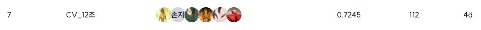

# BoostCamp AI Tech Team 12 
재활용 품목 분류를 위한 Object Detection
  
## 팀원 👩🏻‍💻👨🏻‍💻
| 김한별 | 손지형 | 유지환 | 장희진 | 정승민 | 조현준 |
| :---: | :---: | :---: | :---: | :---: | :---: |
| EDA(초기 streamlit), relabeling, detectron2 모델 experiment, iteration experiment | EDA(초기 streamlit), relabeling, Augmentation detectron2 모델 experiment | mmdetection 3.3.0 ver test, YOLO v5,8,11 test, wrap-up report mmdetection part, ensemble method, confidence score test | mmdetection 3.3.0 ver test, Resolution, TTA | Git setting, Detectron2 test | EDA(streamlit), ensemble |

## Project 설명
바야흐로 대량 생산, 대량 소비의 시대. 우리는 많은 물건이 대량으로 생산되고, 소비되는 시대를 살고 있습니다. 하지만 이러한 문화는 '쓰레기 대란', '매립지 부족'과 같은 여러 사회 문제를 낳고 있습니다.

분리수거는 이러한 환경 부담을 줄일 수 있는 방법 중 하나입니다. 잘 분리배출 된 쓰레기는 자원으로서 가치를 인정받아 재활용되지만, 잘못 분리배출 되면 그대로 폐기물로 분류되어 매립 또는 소각되기 때문입니다.

따라서 우리는 사진에서 쓰레기를 Detection 하는 모델을 만들어 이러한 문제점을 해결해보고자 합니다. 문제 해결을 위한 데이터셋으로는 일반 쓰레기, 플라스틱, 종이, 유리 등 10 종류의 쓰레기가 찍힌 사진 데이터셋이 제공됩니다.

여러분에 의해 만들어진 우수한 성능의 모델은 쓰레기장에 설치되어 정확한 분리수거를 돕거나, 어린아이들의 분리수거 교육 등에 사용될 수 있을 것입니다. 부디 지구를 위기로부터 구해주세요! 🌎

- **Input :** 쓰레기 객체가 담긴 이미지가 모델의 인풋으로 사용됩니다. 또한 bbox 정보(좌표, 카테고리)는 model 학습 시 사용이 됩니다. bbox annotation은 COCO format으로 제공됩니다. (COCO format에 대한 설명은 학습 데이터 개요를 참고해주세요.)
- **Output :** 모델은 bbox 좌표, 카테고리, score 값을 리턴합니다. 이를 submission 양식에 맞게 csv 파일을 만들어 제출합니다. (submission format에 대한 설명은 평가방법을 참고해주세요.)
 

## 실험환경

 
## 실험 내용 
Object Detection을 위한 MMDetection과 Detectron2를 활용하여 프로젝트 진행

- Two Stage Model
    - **MMDetection**
        - DINO - SwinL_Backbone
        - ATSS - SwinL Backbone
        - CO-DETR - SwinL_Backbone
        - Cascade R-CNN - SwinL_Backbone
    - **Detectron2**
        - Faster R-CNN - ResNeXt101_Backbone
        - TridentNet
        - Cascade R-CNN - MViTv2 Backbone
        - EVA-02
- One stage Model
    - YOLO V_5,8,11

 

## 최종 결과
## Model Comparison Table

| Model              | Scheduler                 | Epoch | Backbone      | mAP50(LB_public) | mAP50(LB_private) |
|--------------------|--------------------------|-------|---------------|------------------|-------------------|
| DINO               | CosineAnnealingLR        | 12    | Swin-L        | 0.7140           | 0.7010            |
| YOLO 5             | CosineLR                 | 100   | CSPDarknet53  | 0.4395           | 0.4197            |
| ATSS               | CosineAnnealingLR        | 32    | Swin-L        | 0.7003           | 0.6928            |
| DDQ                | CosineAnnealingLR        | 12    | Swin-L        | 0.6809           | 0.6744            |
| Cascade Mask RCNN  | MultiStepParamScheduler  | 16    | MViTv2        | 0.6513           | 0.6372            |
| EVA                | MultiStepParamScheduler  | 40    | ViT           | 0.6827           | 0.6700            |

 
## LB Private Score
24팀 중 7위 기록

 
## Reference 
[1] Detectron2 https://github.com/facebookresearch/detectron2

[2] MMDetection https://github.com/open-mmlab/mmdetection

[3] MMDetection 3.3.0 https://mmdetection.readthedocs.io/en/latest/get_started.html
